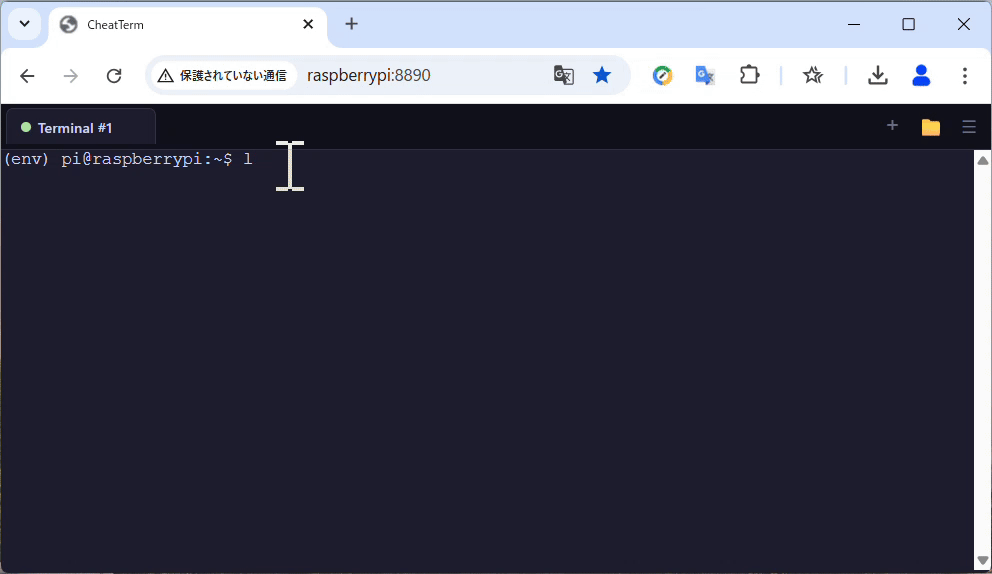

# CheatTerm

## Overview

CheatTerm is a lightweight web terminal that runs from a single Python file. It starts a Tornado server, creates a PTY-backed shell for each browser tab, and connects the browser to that shell over WebSocket. It also supports an optional cheat panel loaded from YAML, so common commands can be searched and pasted into the active terminal. A built-in file manager lets you browse, upload, download, and edit files from the same interface.

## Features

- Single-file server — just one `.py` file, no build step
- Full PTY support — interactive programs, ANSI colors, cursor movement all work
- Multi-tab — open, switch, and close independent terminal and file manager sessions
- File manager — browse, upload, download, zip, rename, delete, and edit files
- Clickable URLs — links in terminal output open in a new browser tab
- URL parameters — launch with a startup command or welcome message
- Command cheat sheet — toggle panel with predefined commands loaded from a YAML file

## Requirements

- OS: Linux or macOS
- Python 3.8+

## Quick Start

```bash
pip install tornado
pip install pyyaml   # optional, required only for cheat sheet support
mkdir -p ~/.local/share/cheatterm
cd ~/.local/share/cheatterm
wget https://raw.githubusercontent.com/covao/CheatTerm/refs/heads/main/cheatterm.py
wget https://raw.githubusercontent.com/covao/CheatTerm/refs/heads/main/cheat.yaml
python ~/.local/share/cheatterm/cheatterm.py
```

If `cheat.yaml` exists in the same directory as `cheatterm.py`, it is loaded automatically.
open [http://localhost:8890](http://localhost:8890) in your browser.

## Installation

```bash
pip install tornado
pip install pyyaml   # optional, required only for cheat sheet support
```

Install the files into the following directory:

- `~/.local/share/cheatterm/cheatterm.py`
- `~/.local/share/cheatterm/cheat.yaml`

Example:

```bash
mkdir -p ~/.local/share/cheatterm
cd ~/.local/share/cheatterm
wget https://raw.githubusercontent.com/covao/CheatTerm/refs/heads/main/cheatterm.py
wget https://raw.githubusercontent.com/covao/CheatTerm/refs/heads/main/cheat.yaml
```

## Auto-start (systemd)
To start CheatTerm automatically on login, create a systemd user service:

```bash
mkdir -p ~/.config/systemd/user
cat > ~/.config/systemd/user/cheatterm.service <<'EOF'
[Unit]
Description=CheatTerm
After=network.target

[Service]
ExecStart=/usr/bin/python3 %h/.local/share/cheatterm/cheatterm.py --port=8890
Restart=always
WorkingDirectory=%h

[Install]
WantedBy=default.target
EOF

systemctl --user daemon-reload
systemctl --user enable --now cheatterm
sudo loginctl enable-linger "$USER"
```

## Uninstallation

Delete the installed files:

```bash
rm -rf ~/.local/share/cheatterm
```

If you enabled auto-start, also remove the user service file:

```bash
systemctl --user disable --now cheatterm
rm -f ~/.config/systemd/user/cheatterm.service
systemctl --user daemon-reload
```

## Usage

### Basic start

```bash
python ~/.local/share/cheatterm/cheatterm.py
```

Open `http://localhost:8890` in your browser. The default port is 8890.

If `~/.local/share/cheatterm/cheat.yaml` exists, the cheat sheet is enabled automatically.

To use a different port:

```bash
python ~/.local/share/cheatterm/cheatterm.py --port=1234
```

Then open `http://localhost:1234` in your browser.

### Command-line options

| Option         | Description                     | Default                                          |
| -------------- | ------------------------------- | ------------------------------------------------ |
| `--port`       | Port number                     | `8890`                                           |
| `--cheat_file` | Path to a YAML cheat sheet file | auto-detect `cheat.yaml` in the script directory |

### File manager

Click the 📁 button in the tab bar or press `Ctrl+Shift+E` to open a file manager tab. Multiple file manager tabs can be open at the same time. Terminal and file manager tabs are numbered independently (Terminal #1, Terminal #2, Files #1, Files #2).

**Browsing:** Double-click a folder to navigate into it. Use the ↑ button or edit the path bar to move around. The path bar always shows the full absolute path (e.g. `/home/pi/Documents`). Click column headers (Name, Size, Modified) to sort. Navigating to a path outside the home directory is silently ignored.

**Uploading:** Click the Upload button or drag and drop files directly onto the file list.

**Downloading:** Click the ↓ button next to a file. For folders, click the 📦 button in the Actions column to download as a zip archive.

**Editing text files:** Click a file name to open it in the editor pane (read-only). Press the Edit button to enable editing. The status bar at the bottom shows the current cursor position (line and column). Press `Ctrl+S` to save. Unsaved changes are indicated with a `*` next to the file name. Binary files and files larger than 1 MB are shown as empty with a notice in the status bar.

**Other actions:** Rename (✏) and Delete (🗑) buttons are available in the Actions column for each item. Use the New Folder button to create directories.

Note: The cheat sheet ☰ button is disabled while a file manager tab is active.

### Command cheat sheet
 
If `cheat.yaml` is in the same directory as `cheatterm.py`, it is loaded automatically. No `--cheat_file` option is needed.
 
Example `cheat.yaml`:
 
```yaml
title: Server Commands
groups:
  - name: Signals
    commands:
      - label: Ctrl+C (interrupt)
        cmd: '\x03'
      - label: Ctrl+Z (suspend)
        cmd: '\x1a'
  - name: System
    commands:
      - label: Disk usage
        cmd: 'df -h\x0a'
      - label: Memory
        cmd: 'free -m\x0a'
```
 
Commands ending with `\x0a` execute immediately on click. Without it, the command is pasted and you press Enter to run it. Control keys like `\x03` (Ctrl+C) are sent as raw signals.
 
A ☰ button appears in the tab bar. Click it to toggle the command panel. The panel includes a search filter.

### URL parameters

You can pass parameters to control what happens when the page loads.

| Parameter | Description                        | Example             |
| --------- | ---------------------------------- | ------------------- |
| `start`   | Run a command on startup           | `?start=htop`       |
| `display` | Show a message before shell output | `?display=Welcome!` |

These can be combined:

```
http://localhost:8890/?display=System%20Monitor&start=htop
```

Parameters only apply to the first tab. Tabs opened with the `+` button start with a plain shell.

### Keyboard shortcuts

| Shortcut         | Action                      |
| ---------------- | --------------------------- |
| `Ctrl+Shift+T`   | New terminal tab            |
| `Ctrl+Shift+E`   | New file manager tab        |
| `Ctrl+Shift+W`   | Close current tab           |
| `Ctrl+Tab`       | Next tab                    |
| `Ctrl+Shift+Tab` | Previous tab                |
| `Ctrl+S`         | Save file (in editor)       |
